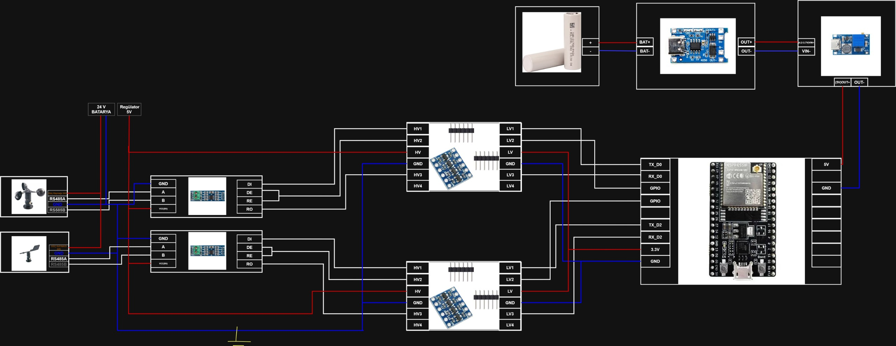
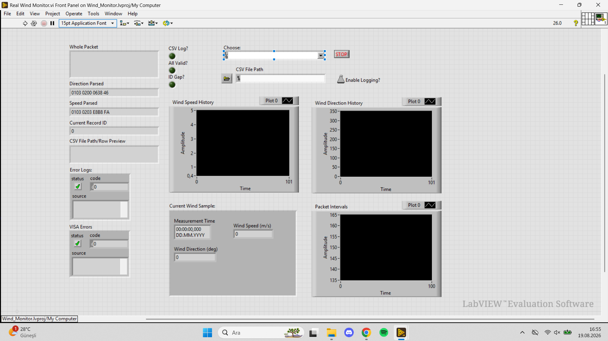
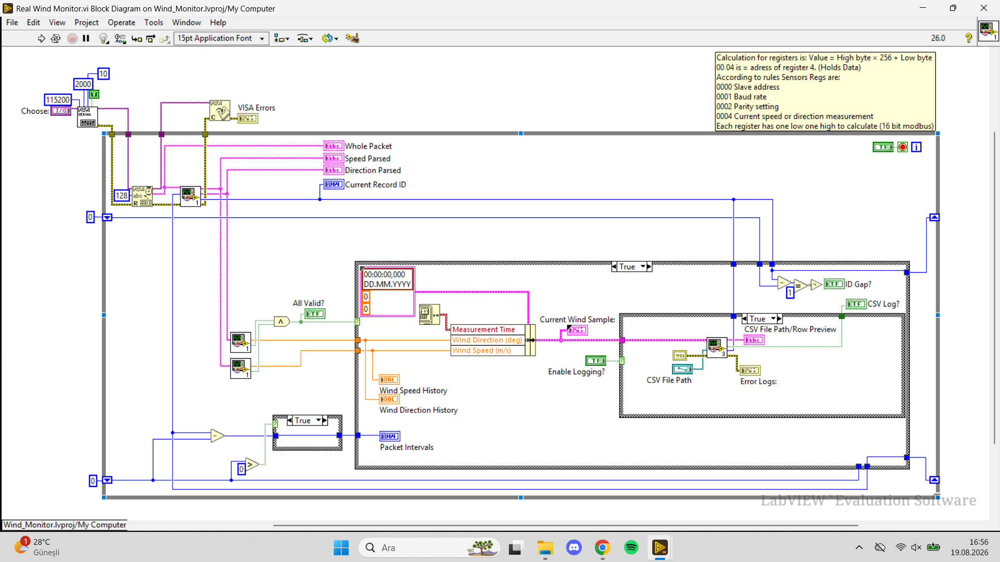

# Embedded Wind Measurement

An embedded wind monitoring system that reads wind speed and wind direction data from FST200 sensors, transfers the measurements through a multi-hop ESP32 network, and displays the data in LabVIEW.

The system combines RS485 / Modbus RTU sensor communication, ESP-NOW wireless transmission, CRC-based data validation, and LabVIEW-based monitoring.

---

## System Architecture

```text
┌──────────────────────┐
│   Wind Speed Sensor  │
└──────────┬───────────┘
           │
           │ RS485 / Modbus RTU
           │
┌──────────▼───────────┐
│ Wind Direction Sensor│
└──────────┬───────────┘
           │
           ▼
┌──────────────────────┐
│      Sensor ESP32    │
└──────────┬───────────┘
           │ ESP-NOW
           ▼
┌──────────────────────┐
│      Repeater 1      │
└──────────┬───────────┘
           │ ESP-NOW
           ▼
┌──────────────────────┐
│      Repeater 2      │
└──────────┬───────────┘
           │ ESP-NOW
           ▼
┌──────────────────────┐
│      Master ESP32    │
└──────────┬───────────┘
           │ USB Serial
           ▼
┌──────────────────────┐
│        LabVIEW       │
└──────────────────────┘

The sensor ESP32 reads both FST200 sensors through separate UART / RS485 interfaces. Valid measurements are combined into a single data frame and transmitted through two ESP-NOW repeaters to the master ESP32.

The master ESP32 forwards the received data to the computer through USB serial communication, where LabVIEW parses, displays, and records the measurements.

---

## Features

- Wind speed and wind direction measurement
- RS485 / Modbus RTU communication
- Separate UART interfaces for both sensors
- Modbus CRC-16 validation
- ESP-NOW multi-hop wireless communication
- Packet CRC-32 validation
- Duplicate and invalid packet filtering
- Record ID and sensor timestamp tracking
- USB serial communication with LabVIEW
- LabVIEW-based visualization and data logging

---

## Hardware

- ESP32 development boards
- FST200 wind speed sensor
- FST200 wind direction sensor
- RS485 transceiver modules
- Logic level shifters
- External sensor power supply

### Wiring



---

## Firmware

The firmware is divided according to the role of each ESP32 node.

firmware/
├── sensor/
│   └── sensor.ino
├── repeater-1/
│   └── repeater-1.ino
├── repeater-2/
│   └── repeater-2.ino
└── master/
    └── master.ino

### Sensor ESP32

The sensor node:

- Queries the wind speed and direction sensors over Modbus RTU
- Validates sensor responses using CRC-16
- Combines both sensor responses into one payload
- Adds a record ID and acquisition timestamp
- Generates a CRC-32 protected ESP-NOW frame
- Sends the frame to the first repeater

### Repeaters

The repeater nodes:

- Receive ESP-NOW data frames
- Verify the sender and packet integrity
- Validate the embedded Modbus responses
- Reject duplicate or outdated records
- Forward valid data to the next node

### Master ESP32

The master node:

- Receives data from the final repeater
- Validates the received frame
- Filters duplicate records
- Converts the payload into a serial message
- Transfers the measurement data to LabVIEW

Serial output format:

D;<Record ID>;<Sensor Time ms>;<Payload HEX>

---

## LabVIEW

The LabVIEW application receives the serial data from the master ESP32 and processes the incoming wind measurements.

Main functions include:

- Serial data acquisition
- Master frame parsing
- FST200 speed response decoding
- FST200 direction response decoding
- Modbus CRC-16 verification
- Wind data visualization
- Measurement logging

### Front Panel



### Block Diagram



---

## Repository Structure

embedded-wind-measurement/
├── firmware/
│   ├── sensor/
│   │   └── sensor.ino
│   ├── repeater-1/
│   │   └── repeater-1.ino
│   ├── repeater-2/
│   │   └── repeater-2.ino
│   └── master/
│       └── master.ino
├── labview/
│   ├── Wind_Monitor.lvproj
│   ├── Real Wind Monitor USB.vi
│   ├── Parse Master Frame.vi
│   ├── Parse Master USB Packet.vi
│   ├── Decode FST200 Speed Response.vi
│   ├── Decode FST200 Direction Response.vi
│   ├── Calculate Modbus CRC16.vi
│   ├── Write Real Wind Sample.vi
│   └── Real Wind Sample.ctl
├── docs/
│   └── images/
│       ├── hardware-wiring.jpeg
│       ├── labview-front-panel.png
│       └── labview-block-diagram.png
├── README.md
└── .gitignore

---

## Communication Flow

1. The FST200 wind sensors are queried using Modbus RTU over RS485.
2. The sensor ESP32 validates both responses using CRC-16.
3. Valid measurements are combined into a single packet.
4. The packet is protected with CRC-32.
5. The data is transmitted through the ESP-NOW repeater chain.
6. The master ESP32 receives and validates the final packet.
7. The master sends the measurement data to the computer over USB serial.
8. LabVIEW parses, visualizes, and logs the incoming data.

---

## Demo

Project demo video will be added here.
